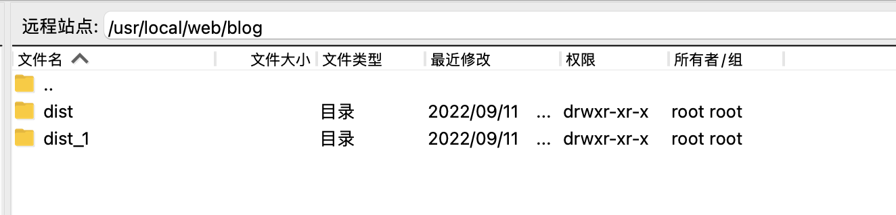

# Web 自动部署服务 Scp 会自动保留以前版本

1. 安装依赖yarn
2. 创建这个测试目录 /usr/local/web/test 
3. yarn build:mac or yarn build:win

## 参数说明

DIR_MAX_LEN 保留版本次数 1-n 切记不要输入0；

IS_REMOVE_END_PATH 上传成功是否删除 dist 目录

| host     | port           | username | password | path     | command                |
| -------- | -------------- | -------- | -------- | -------- | ---------------------- |
| 服务器ip | 端口：22 or "" | 账号     | 密码     | 上传路径 | 上传之前先删除目标文件 |

## 示例图片

